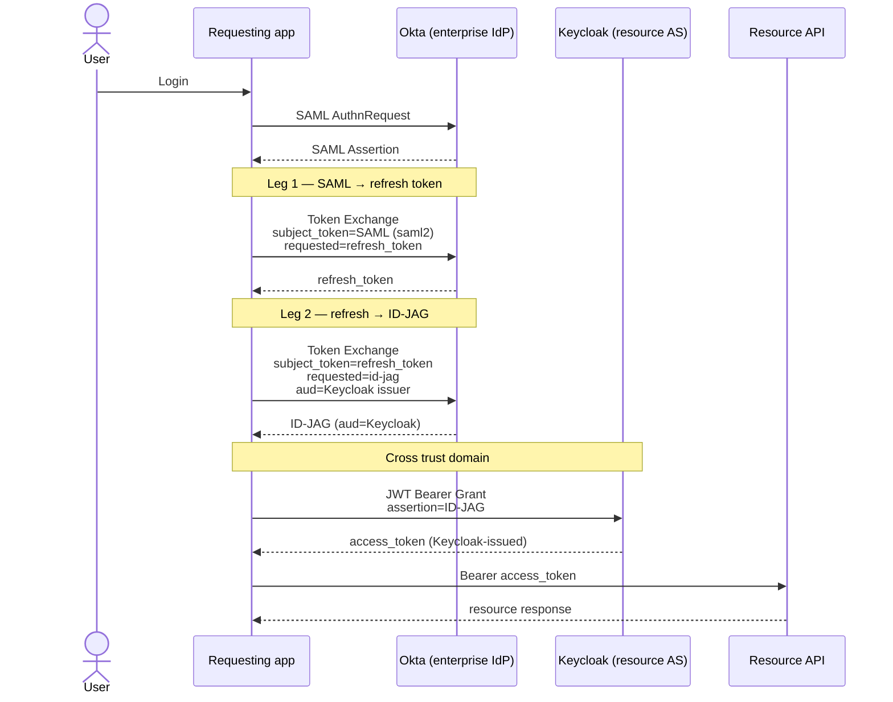

The [Identity Assertion JWT Authorization Grant (ID-JAG)](https://datatracker.ietf.org/doc/draft-ietf-oauth-identity-assertion-authz-grant/) draft, which is the core of [Cross-App Access (XAA)](https://xaa.dev), standardizes how enterprises broker access to APIs and MCP resources across identity boundaries (think "SaaS" APIs and MCP servers).

Enterprises already use their Enterprise IdP for SSO, but SSO only identifies the user. It says nothing about that user's permissions on GitHub, Asana, Figma, and so on. You might say "we already use SSO on those apps" ... and you do, for login (usually to some UI). Those apps still need *scoped OAuth access tokens* for API access, not just an identity assertion. ID-JAG is the bridge: convert enterprise user identity into those scoped tokens, under IdP policy.

The flow looks like this:

1. The user signs into the requesting app via SSO (OIDC ID Token or SAML assertion), so the app knows who they are.
2. When the app needs to call an external resource (SaaS API, MCP server, etc.), it exchanges that identity assertion at the enterprise IdP for an intermediate **ID-JAG** via [OAuth 2.0 Token Exchange](https://datatracker.ietf.org/doc/html/rfc8693). This is where the enterprise decides whether to allow the access, what scopes to grant, and how to manage the authorization lifecycle.
3. The app presents the ID-JAG to the resource authorization server as a [JWT authorization grant](https://datatracker.ietf.org/doc/html/rfc7523) and receives a provider-scoped access token.
4. The app uses that access token to call the resource (MCP tools, APIs, etc.).

The user never sees an OAuth consent screen at the SaaS app. Access is pre-decided by the enterprise IdP and controlled by admin policy.

I recently dug into a working example with Okta and Keycloak. Since ID-JAG is an open OAuth draft / spec, the most important part of the story is interoperability. And to take it one step further: although the happy path in the draft is OIDC for user identity assertions, enterprises still standardize around SAML. So let's build an Okta SAML-based requesting app, follow the ID-JAG SAML profile, and redeem that grant at a *different* identity domain — Keycloak standing in for the resource authorization server.

Everything here is reproducible from [christian-posta/okta-saml-idjag](https://github.com/christian-posta/okta-saml-idjag).

## Actors in this demo

Worth naming explicitly up front, because "app" and "agent" blur quickly:

| Role | In this demo | What it does |
|---|---|---|
| **User** | Okta test user (`mcpuser@…`) | Authenticates via SAML SSO |
| **Requesting app** | Local demo app (`localhost:4141`) | Holds the SAML session, drives both token exchanges, calls the resource |
| **Enterprise IdP** | Okta (Integrator / XAA early access) | Issues SAML assertions and ID-JAGs under admin policy |
| **AI Agent (OAuth client)** | Okta "AI Agent" registration | The `private_key_jwt` client that actually calls Okta's token endpoint |
| **Resource AS** | Keycloak realm `idjag-resource` | Trusts Okta's ID-JAG, mints its own access token |
| **Resource client** | `idjag-demo-client` | Client that presents the ID-JAG at Keycloak (`client_id` claim must match) |

The requesting app and the Okta AI Agent are related but not the same object. The user signs into the SAML app; the AI Agent is the OAuth client allowed to exchange that identity for an ID-JAG.

## The end-to-end path (including the SAML hop)

OIDC-shaped XAA is often drawn as one token exchange at the IdP, then a JWT bearer grant at the resource. With SAML, the draft adds a pre-step: turn the SAML assertion into a refresh token first, then exchange that refresh token for the ID-JAG.



Why the extra leg? A SAML assertion proves the IdP authenticated the user, but it is not a durable OAuth subject the way an ID token or refresh token is. The [SAML interoperability section](https://www.ietf.org/archive/id/draft-ietf-oauth-identity-assertion-authz-grant-04.html#name-saml-20-subject-token-inter) profiles **assertion → refresh**, then **refresh → ID-JAG**. With OIDC you can often go ID Token → ID-JAG in one exchange; with SAML you pay the two-leg tax. That is intentional in the draft, not an Okta quirk.

## Setting up Okta for SAML and XAA

Okta has early access to XAA in its enterprise product and in free [Integrator accounts](https://developer.okta.com). We build a demo app that logs a user in with SAML:


### The three Okta objects that have to link

Okta needs **three objects** plus I use a local signing key (instead of client secrets). Here's a flow diagram of the pieces:


| Okta object | Role | Key fields |
|---|---|---|
| **SAML app** | App the user signs into. Its assertion is the subject of leg 1. | ACS, Audience, NameID=email |
| **AI Agent** | OAuth client that authenticates the token exchange via `private_key_jwt`. **Not** a normal OIDC app. | Credentials (public key), Delegation → SAML app, Resource connection → resource app |
| **Resource app (OIDC)** | Defines the resource being accessed; Resource Server issuer URL becomes ID-JAG `aud`. | Enable XAA + Issuer URL = Keycloak realm issuer |
| **Local RSA keypair** | Signs the agent's `client_assertion`. Public half registered on the agent. | e.g. `kid=okta-xaa-1` |

Full click-path: [docs/okta-setup.md](https://github.com/christian-posta/okta-saml-idjag/blob/main/docs/okta-setup.md). One constraint that matters early: the resource issuer must be a **real, reachable, distinct authorization server** (not Okta's own org AS). Okta validates RFC 8414 metadata when you save the Resource app, so Keycloak (exposed publicly, e.g. via ngrok) needs to be up first.

### SAML app and login

Create the Okta SAML app, wire ACS / audience, assign users/groups:


Once that is wired into the demo app, login should land on a dashboard:


### Leg 1 and leg 2 at Okta's token endpoint

From the [SAML interoperability section](https://www.ietf.org/archive/id/draft-ietf-oauth-identity-assertion-authz-grant-04.html#name-saml-20-subject-token-inter), exchange the SAML assertion for a refresh token first:

```http
POST /oauth2/token HTTP/1.1
Host: acme.idp.example
Content-Type: application/x-www-form-urlencoded

grant_type=urn:ietf:params:oauth:grant-type:token-exchange
&requested_token_type=urn:ietf:params:oauth:token-type:refresh_token
&scope=openid+offline_access+email
&subject_token=PHNhbWxwOkFzc2VydGlvbiB4bWxuczp...c2FtbDppc3N1ZXI+PC9zYW1sOkFzc2VydGlvbj4=
&subject_token_type=urn:ietf:params:oauth:token-type:saml2
&client_assertion_type=urn:ietf:params:oauth:client-assertion-type:jwt-bearer
&client_assertion=eyJhbGciOiJSUzI1NiIsImtpZCI6IjIyIn0...
```

```http
HTTP/1.1 200 OK
Content-Type: application/json
Cache-Control: no-store

{
  "issued_token_type": "urn:ietf:params:oauth:token-type:refresh_token",
  "access_token": "vF9dft4qmTcXkZ26zL8b6u",
  "token_type": "N_A",
  "scope": "openid offline_access email",
  "expires_in": 1209600
}
```

Then follow the [refresh → ID-JAG exchange](https://www.ietf.org/archive/id/draft-ietf-oauth-identity-assertion-authz-grant-04.html#name-example-token-exchange-using):

```http
POST /oauth2/token HTTP/1.1
Host: acme.idp.example
Content-Type: application/x-www-form-urlencoded

grant_type=urn:ietf:params:oauth:grant-type:token-exchange
&requested_token_type=urn:ietf:params:oauth:token-type:id-jag
&audience=https://keycloak.example/realms/idjag-resource
&scope=demo:read+demo:write
&subject_token=tGzv3JOkF0XG5Qx2TlKWIA
&subject_token_type=urn:ietf:params:oauth:token-type:refresh_token
&client_assertion_type=urn:ietf:params:oauth:client-assertion-type:jwt-bearer
&client_assertion=eyJhbGciOiJSUzI1NiIsImtpZCI6IjIyIn0...
```

A few Okta-specific notes on that second call:

- Authenticate as the **AI Agent** with `private_key_jwt` (`iss`/`sub` = agent `client_id`, `aud` = Okta token endpoint).
- Set `audience` to the Keycloak realm issuer (the Resource app's XAA issuer URL).
- Do **not** send a `resource` parameter — Okta rejects it here (`'resource' is invalid or not supported`), even though some draft examples include it.

In the demo UI, **Get ID-JAG** runs both legs:


### What the ID-JAG actually carries

An annotated shape of what Okta minted in this run (values shortened):

```jsonc
// header
{
  "alg": "RS256",
  "kid": "…",
  "typ": "oauth-id-jag+jwt"   // marks this as an ID-JAG, not a normal access token
}

// claims
{
  "iss": "https://integrator-….okta.com",                 // enterprise IdP
  "aud": "https://…/realms/idjag-resource",               // Keycloak realm issuer
  "client_id": "idjag-demo-client",                       // client that will redeem at Keycloak
  "sub": "00u…",                                          // Okta user id
  "sub_profile": "user",                                  // entity profile, "user" (or "ai_agent")
  "email": "mcpuser@example.org",                         // from SAML NameID / profile
  "act": { "sub": "wlp…", "sub_profile": "ai_agent" },    // the AI Agent that did the exchange
  "scope": "demo:read demo:write",                        // scopes for the *resource* domain
  "exp": …                                                // short-lived (~300s on Okta)
}
```

Read that carefully:

- `aud` is **Keycloak**, not Okta — the grant is audience-restricted to the resource AS.
- `client_id` is the client that will present the grant at Keycloak (`idjag-demo-client`), not the Okta AI Agent client id.
- `scope` values are resource-domain scopes, decided by Okta policy / resource connection.
- `act` attributes the exchange to the AI Agent acting on the user's behalf.
- `sub` Okta user id
- `sub_profile` from the new [Entity Profiles draft](https://www.ietf.org/archive/id/draft-mora-oauth-entity-profiles-01.html#name-entity-profiles)
- This is a **grant**, not an access token. It cannot call the API directly; it only exists to be redeemed.


## Exchange the ID-JAG across an identity boundary

For the resource side, [we run Keycloak](https://github.com/christian-posta/okta-saml-idjag/blob/main/docker-compose.yaml) with the [JWT Authorization Grant](https://www.keycloak.org/2026/01/jwt-authorization-grant) feature (GA in Keycloak 26.6). That is the RFC 7523 grant that *consumes* an ID-JAG. Keycloak is [also working on](https://github.com/keycloak/keycloak/issues/48818) the enterprise-IdP side (issuing ID-JAGs); here it only plays resource AS.

Setup details: [docs/keycloak-setup.md](https://github.com/christian-posta/okta-saml-idjag/blob/main/docs/keycloak-setup.md). The three pieces that matter:

1. **Identity Provider** of type `jwt-authorization-grant`, trusting Okta's `iss` + org JWKS.
2. **Confidential client** `idjag-demo-client` with JWT authorization grant enabled, allowed IdPs including that Okta IdP.
3. **Pre-provisioned user** linked by federated identity `(okta-idjag, Okta sub)` — this grant is non-interactive, so JIT / first-broker-login does not run.


Back in the demo, **Exchange at Keycloak**:


The HTTP shape is RFC 7523 jwt-bearer (not another token exchange):

```http
POST /realms/idjag-resource/protocol/openid-connect/token HTTP/1.1
Host: keycloak.example
Authorization: Basic base64(idjag-demo-client:…)
Content-Type: application/x-www-form-urlencoded

grant_type=urn:ietf:params:oauth:grant-type:jwt-bearer
&assertion=eyJhbGciOiJSUzI1NiIsInR5cCI6Im9hdXRoLWlkLWphZytqd3QiLC… 
```

Keycloak then:

1. Matches `iss` → the Okta jwt-authorization-grant IdP
2. Verifies the signature against Okta's JWKS
3. Checks `aud` equals this realm's issuer
4. Checks ID-JAG `client_id` equals the authenticating client
5. Resolves the user by `(okta-idjag, sub)`
6. Issues its **own** access token


That last hop is the point of XAA: Okta brokered cross-domain API access using the same SSO trust relationship, without a consent screen at Keycloak / the resource.

<div style="background-color: #e7f3ff; border-left: 4px solid #308cbc; border-right: 1px solid #b8daff; border-top: 1px solid #b8daff; border-bottom: 1px solid #b8daff; padding: 1em 1.5em; margin: 1.5em 0; border-radius: 0 5px 5px 0; box-shadow: 0 2px 4px rgba(0,0,0,0.06); font-size: 1.05em; line-height: 1.6;">
<strong>Gotchas that ate the most time</strong>
<ul>
<li>The token-exchange client must be the <strong>AI Agent</strong> ... we use <code>private_key_jwt</code> to identify the client (instead of client secret). If you try to use a normal OIDC Web/API, the Okta flow tends to land in On-Behalf-Of and fail with <code>actor_token missing</code>.</li>
<li>Okta rejects a <code>resource</code> parameter on this token exchange even when draft examples show one.</li>
<li><code>audience</code> must be a <strong>distinct, reachable</strong> resource AS issuer (RFC 8414).</li>
<li>SAML <code>subject_token</code> is <strong>standard base64</strong>, not base64url.</li>
<li>Keycloak must advertise an <code>https</code> issuer (e.g. set <code>KC_HOSTNAME</code> to the ngrok URL) or Okta will not accept it as the XAA resource.</li>
<li>Pre-provision the Keycloak user with federated identity keyed on the Okta <code>sub</code>, or redemption fails with <code>User not found</code>.</li>
<li>ID-JAG lifetime on Okta is short (~300s) ...  redeem promptly.</li>
</ul>
</div>

## Recreate This Demo

This path works end-to-end today:

**Okta (SAML enterprise IdP + XAA) → ID-JAG → Keycloak (resource AS JWT authorization grant) → access token → API call**

That is the interoperability story that matters for ID-JAG: different vendors, different trust domains, SAML on the enterprise side, open-source AS on the resource side.

If you want to reproduce: [github.com/christian-posta/okta-saml-idjag](https://github.com/christian-posta/okta-saml-idjag). Follow along / [connect on LinkedIn](https://linkedin.com/in/ceposta) if you are working through XAA / ID-JAG in your own stack.
