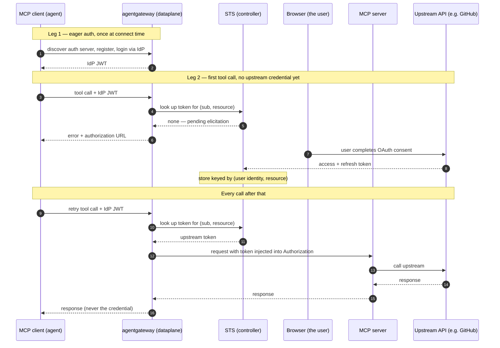

Your AI agent needs to call APIs, LLMs, databases, and SaaS services, MCP etc. Every one of those calls has to authenticate somehow. So before you get to sandboxing, egress rules, or where the agent runs, there's a more basic question: at the moment the agent makes a call, where does the credential live? If the answer is anywhere the agent can read, e.g. its environment, its config, its context window etc then you've decided to trust the agent with a reusable secret. 

That decision deserves more scrutiny than it tends to get. Especially in sensitive enterprise environments. 

The problem with the vast majority of these credentials is that they're [long-lived, coarse grained, bearer credentials](https://blog.christianposta.com/api-keys-are-a-bad-idea-for-enterprise-llm-agent-and-mcp-access/). "Bearer" means exactly what it sounds like: **anyone** holding the credential can use it, and nothing about the request proves the holder is the intended holder. That single property is the root of the problem. Prompt injection, exfiltration, and accidental disclosure sound like three different attacks, but they're just delivery mechanisms for the same failure mode: the bytes of a sensitive credential leave the agent and still work.

And leaking isn't even the interesting case. An agent may hand over its credentials without being attacked at all: "Hey, can you do this for me? Here's my API key." Remember what AI agents are goal-oriented, stochastic systems. It isn't know/think its misbehaving when it does that. It believes it's solving your problem.

So what options do we actually have?

* **Make the credential expire fast.** Short-lived credentials still leak, but the window where a leaked one is useful shrinks to minutes.
* **Make the credential non-transferable.** Sender constraints with proof of possession, pinning the credential to a key or cert; mean holding the bytes isn't enough.
* **Don't give the agent a credential at all.** No API keys, no tokens, nothing reusable sitting in the agent's memory, environment, or it can get ahold of directly.

The first two shrink the blast radius of a leak. The third option removes the thing that leaks.

But if the agent holds "nothing", how does it do anything useful? Every external call still has to authenticate, and something still has to enforce policy on it.

That's the **credential brokering pattern**. The short version: the agent makes its call without a credential, and something else on the path attaches the real one before the request reaches its destination. The agent never holds the credential, never sees it, and can't leak it. That's much easier to describe than to build, so let's look at what it actually takes.

## Credential Brokering 4 AI Agents (CB4A)

We'll start with the IETF [draft from Kenneth G. Hartman: Credential Broker 4 Agents (CB4A)](https://datatracker.ietf.org/doc/html/draft-hartman-credential-broker-4-agents-00), published March 2026. 

The TL;DR:

* **Separate the policy decision point (PDP) from the credential delivery point (CDP).** The component that decides "yes" should never touch credentials, and the component that hands out credentials should never be the one deciding. 
* **Three models for how the broker mediates access.** Model B mints a short-lived, narrowly scoped token and hands it to the agent. Model A never gives the agent a real credential at all, proxying the call and injecting the credential on the way out. Model C hands over the real long-lived credential and schedules revocation afterward, which the draft calls the weakest option and does not recommend.
* **Sender constraints via DPoP** (RFC 9449), so a stolen token is useless without the matching proof of possession.
* **Built on SPIFFE/SPIRE workload identity** rather than a bespoke identity layer.

Worth noting what the draft picks as its real-world motivation: the March 2026 TeamPCP supply chain compromise of LiteLLM, an AI gateway whose entire job was holding API keys for dozens of providers. The draft's read is the same one I'll come back to in part 2 -- "when AI infrastructure concentrates long-lived credentials in a single process or configuration, compromise of that process yields catastrophic access."

The draft's recommended primary is Model B, with Model A as the selective fallback. I'm going to argue that for most enterprises today, that recommendation is backward. Model A is the primary approach.

Take a look at these [interactive protocol flow diagrams](https://protocol-explorer.dev/cb4a/happy-path) for CB4A if you want to see how it worksit step by step.

Basically: based on the agent's identity (SPIFFE) plus whatever auth context is available, the PDP decides whether this agent should get a credential for the action it's attempting, and the CDP issues a short-lived, sender-constrained one. If that credential leaks, it's useless to whoever picked it up, because they don't hold the key it's bound to.

And honestly? If we could sender-constrain every token and every receiver actually verified the binding, this would work!!. But that's not the world we live in. DPoP takes two to participants: the authorization server has to issue a key-bound token, *and* the resource server has to check the proof on every request. Miss either half and we're back to bearer token again. GitHub PATs, API keys, the overwhelming majority of SaaS OAuth tokens: none of them check sender constraints.

There's a second problem, and the draft names it itself. Model B's listed weakness is that "the agent holds a real (if temporary) credential in memory." Short-lived is better than long-lived, but it's still a reusable secret sitting inside the stochastic system we just said we don't trust with reusable secrets. Shrinking the window isn't the same as closing it.

That's Model A, the [Proxy Gateway](https://datatracker.ietf.org/doc/html/draft-hartman-credential-broker-4-agents-00#name-model-a-proxy-gateway). No credential is ever shared with the agent. Every call egresses through the gateway, policy gets enforced there, and the sensitive bearer credential is injected into the outbound request just in time. Nothing on the agent's side of that connection is worth stealing.

This model gets you: 

* **Strongest isolation.** The agent never sees, holds, or transmits a real credential.
* **Full visibility.** The broker can inspect, log, and filter every request and response in real time.
* **Universal compatibility.** Works with any target API without requiring the target to support short-lived tokens.

And its verdict: _"Best for high-security environments where credential isolation is paramount, or as a fallback for target services that do not support short-lived tokens natively."_

## Agentgateway as a CB4A Proxy Gateway

This is the pattern we implement in [Solo Enterprise for agentgateway](https://www.solo.io/products/agentgateway). And with recent [open-source contributions from the community](https://agentgateway.dev/blog/2026-07-12-agentgateway-token-exchange-jwt-assertion-entra-obo/), you can build a real piece of it on OSS agentgateway too. `backendAuth.oauthTokenExchange` now covers [RFC 8693 token exchange, RFC 7523 JWT bearer assertions](https://agentgateway.dev/docs/standalone/main/configuration/security/backend-authn/), and Microsoft Entra's on-behalf-of flow, all as gateway-side configuration. The agent presents its inbound token, the gateway exchanges it, and the upstream credential gets attached on the way out. The agent never sees the result.

That works when an exchange can produce the upstream credential on demand. But plenty of real targets can't do that. GitHub, Slack, Salesforce, JIRA: there's no exchange path from your corporate IdP to a GitHub token. GitHub wants its own OAuth token, obtained by that specific user consenting in a browser. You can't mint it. You have to go get it once, and then hold onto it.

### Cross Identity Domain Brokering

Keeping these separate matters, because they solve different problems.

**Leg 1 gets the user into the gateway.** An MCP client like Claude Code or VS Code discovers the authorization server, registers dynamically with your IdP through the gateway, and sends the user through IdP login. The client comes back with a JWT. Crucially this happens at connect time, not on every tool call, which is why the docs call it ["eager auth"](https://docs.solo.io/agentgateway/latest/mcp/auth/about/). By the time any tool executes, the gateway already knows which human is behind it.

**Leg 2 gets the user out to the upstream.** When the gateway sees a call to a backend needing a third-party OAuth credential it doesn't have, it doesn't forward the request. It fails it and hands back an authorization URL. The user opens that URL, completes OAuth consent in their own browser, and the gateway captures the resulting access and refresh tokens and stores them in its STS, keyed by user identity and resource. Every later call from that user to that resource gets the token injected into the `Authorization` header on the way upstream. Solo calls this an [elicitation](https://docs.solo.io/agentgateway/latest/mcp/token-exchange/elicitations/overview/) -- borrowing the MCP term for the idea, though the mechanism today is its own flow rather than the spec's `urlMode` message.

### "Isn't ID-JAG supposed to fix this?"

Fair question, and it's the one I'd ask. [ID-JAG](/okta-saml-and-keycloak-for-id-jag-cross-app-access/), the Identity Assertion JWT Authorization Grant at the core of [Cross-App Access](https://xaa.dev), is built for exactly this boundary. The enterprise IdP converts a user's identity assertion into a provider-scoped access token under admin policy, and the user never sees an OAuth consent screen at the SaaS app at all.

There are two reasons it doesn't remove the need for what I just described.

**Adoption.** ID-JAG only works when both ends implement it. Your enterprise IdP has to mint the grant, and the resource's authorization server has to accept it as a JWT authorization grant. Today that's a small set of providers on each side. GitHub is not going to take an ID-JAG from your Okta tenant. Until that changes, elicitation/eager auth is how you get across that boundary at all.

**And this is the one people miss: ID-JAG does not eliminate the token store.** At the end of that flow you are still holding a provider-scoped access token, and something on the path still has to keep it so that the next tool call doesn't replay the entire exchange. Even the OSS token exchange path caches its results, keyed by subject and grant parameters. What ID-JAG changes is *how the token got authorized* -- admin policy at the IdP, rather than a user clicking Authorize in a browser. That's a real improvement in governance. It is not a change in where the credential ends up.

So the consent screen goes away. The vault does not.

### Agentgateway implements Model A of CB4A

* **The MCP server never sees it.** It has no knowledge of the elicitation, the IdP, or the STS. It receives a normal request with a valid token already in the header.
* **The agent never sees it either.** It gets the API response, not the credential.
* **Tokens bind to user identity, not to a session.** Alice's GitHub token is Alice's, keyed to her `sub` and the resource.
* **Credentials are injected just in time on egress** A policy decides whether the call is allowed; if so, inject the sensitive credentials

### New Attack Surface

The STS keeps all of this in a database. SQLite by default, which loses everything on controller restart, so anything real uses PostgreSQL.

Read that again, because it's the whole reason there's a part 2 to this post. We just built a database that holds every user's GitHub token, every Slack token, every upstream credential in the environment. We didn't eliminate the credentials. We just created a high-value target.

## The broker becomes the target

The CB4A draft doesn't sugarcoat where this leaves you. Its threat model rates broker compromise (TM-1) as CRITICAL:

> The broker (CDP) is the highest-value target in the architecture. It MUST be hardened with no shell access, restricted network, and credential zeroing after minting (TM-1).

So before going down this path you need a real answer for hardening the component holding the credentials, and for removing any standing decrypt permission from it. In [part 2](/credential-brokering-patterns-for-ai-agent-egress-part2/), I get specific about how we do that in Solo Enterprise for agentgateway: envelope encryption with KEK/DEK wrapping, the master key in KMS rather than the cluster, and a separate broker that must authorize every individual unwrap, so the component holding the ciphertext cannot decrypt it with its own credentials. Including where it still leaks. Follow along / [connect on LinkedIn](https://linkedin.com/in/ceposta) if you are working through credential isolation for agent egress in your own stack.
