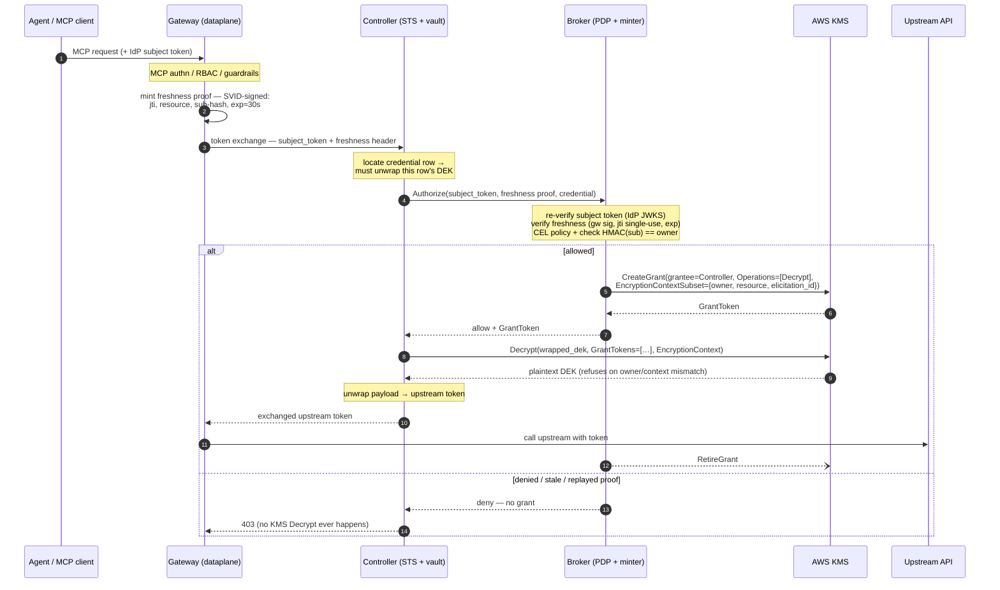

In [part 1](/credential-brokering-patterns-for-ai-agent-egress/) I made the case that the only credential brokering model from [the CB4A paper](https://www.ietf.org/archive/id/draft-hartman-credential-broker-4-agents-00.html) that really works for AI agents today is the one where the agent never holds a credential at all. The agent uses its identity/OBO, calls through the proxy, the proxy injects the real token just in time, and the agent's memory never contains anything credential. The agent can't be tricked to exfiltrate (or willingly hand over) any credentials.

Although the agent doesn't see the real tokens, we didn't really _get rid of them_. We just moved them. The proxy's token store now holds every user's GitHub token, every Slack token, every upstream API key in the environment. The CB4A draft is blunt about this: the broker ["is the highest-value target in the architecture."](https://www.ietf.org/archive/id/draft-hartman-credential-broker-4-agents-00.html#name-security-considerations) If the broker/controller/etc is compromised its blast radius is all of the credentials.

The CB4a paper refers to the [LiteLLM incident](https://docs.litellm.ai/blog/security-update-march-2026) here. That was a **supply-chain RCE**, not a stolen database backup. The attacker got code execution inside the very component that legitimately holds the keys. "We encrypt at rest" is not an answer to that. The compromised process *is* the thing holding the decryption capability.

So this post answers one narrow question:

> **When the process holding the token store is fully compromised, how much of the store can the attacker read?**

Let's look at three different approaches to securing this broker, and the answer to the above question for each. 

## Who holds what

Two components matter. The **gateway** (the Rust dataplane) terminates the agent's MCP connection, enforces policy, and calls token exchange to get an upstream credential. The **controller** runs the Secure Token Service (STS) which does RFC 8693 token exchange and owns the token vault. The controller/STS is responsible for encrypting the database rows holding user credentials.

<< NOTE: we'll get asked: why are we storing this into a database? why not Vault/BAO/Secret Store/etc .. need to answer this. >>

The controller (aka STS, but I'll refer to it as controller) is the blast radius center. It holds the ciphertext, it does the decrypt, and it hands the plaintext upstream token back to the gateway. It's the component that *has* to touch plaintext, which is exactly what makes it interesting. One assumption held constant throughout: the gateway is inside the confidentiality boundary for the specific token a live request is servicing. It has to be. It's the thing putting that token on the wire to GitHub for example. What we're protecting is **the rest of the store**: everyone else's credentials, and this user's other credentials, at the moment of compromise.

## Envelope encryption, quickly

Every stored credential gets two nested AES-256-GCM layers.

| Layer | Encrypts | Key | AAD | Computed by |
|---|---|---|---|---|
| **Inner** | the token JSON (access, refresh, id token) | per-row **DEK** (ephemeral) | `elicitation_id`, `envelope_version` | the controller, in-process |
| **Outer** | the 32-byte DEK | the **KEK** | the KMS `EncryptionContext` | KMS, inside its HSM |

A **DEK** (data encryption key) is generated fresh for *every single credential*. One row, one key. The DEK encrypts the payload locally, then the DEK itself gets **wrapped** (encrypted) under a **KEK** (key encryption key). What lands in the database is the ciphertext plus the wrapped DEK. Reading a credential means unwrapping its DEK first, then decrypting the payload with it.

Why bother with two layers? Because the KEK never has to leave its custodian. It only ever encrypts and decrypts 32-byte DEKs, never application data.

Both layers use **AAD**, additional authenticated data. AAD isn't encrypted and isn't secret. It gets mixed into the GCM authentication tag. Present different AAD at decrypt time and the tag fails. No plaintext. That's cryptography, not policy. For the outer layer, the AAD is the KMS `EncryptionContext`:

```
elicitation_id   = the credential row's identity
envelope_version = 2
kek_id           = which KMS key wrapped this
owner            = HMAC(user_id)      # <-- this one does the real work later
resource         = e.g. https://api.github.com
```

Remember that `owner` and `resource` live in the *outer* AAD. That placement is the whole trick in the third mode. It's the difference between "we have a policy about ownership" and "AWS enforces ownership."

Now the three tiers. The real question here is: **who holds the KEK, and what it takes to unwrap a DEK.**

---

## Mode 1 — KEK in a Kubernetes Secret

The baseline. A 32-byte KEK lives in a Kubernetes Secret, read once at pod startup. Wrap and unwrap are local AES-GCM calls inside the controller.

```yaml
tokenExchange:
  enabled: true
  storage:
    envelope:
      provider: k8s-secret      # default
```

Against the yardstick:

- **DB dump theft?** Survives. A stolen `encrypted_tokens` table or a SQL backup is ciphertext. That's real protection, and it's why you never store tokens in the clear even in dev.
- **Controller compromise?** Fails completely. The KEK lives in the same trust domain as the thing you're worried about. Anyone who can read that Secret (the controller's ServiceAccount, any cluster-admin, an etcd backup, a node with the projected token) gets the master key and decrypts **the entire store, offline, forever**. The attacker doesn't even have to stay resident. Steal the KEK once and every current *and future* row is readable off-box, at leisure.
- **Residual:** everything. No audit trail, because these are in-process AES calls and they're invisible. No revocation, because you can't un-leak a key. Rotation is manual and restart-gated.

Fine for dev and low-value stores where you don't want an external dependency. Not an answer to the threat in this post.

## Mode 2 — KEK in AWS KMS

Now the KEK is a KMS customer key that **never leaves KMS**. The controller wraps and unwraps by calling `kms:Encrypt` and `kms:Decrypt`, passing the per-row `EncryptionContext`, which KMS authenticates on both calls and writes into CloudTrail.

```yaml
tokenExchange:
  enabled: true
  storage:
    envelope:
      provider: aws-kms
      awskms:
        keyId: alias/agw-token-exchange
        region: us-west-2
      dekCache: { ttl: 1m, maxEntries: 1024 }
```

The controller's IAM identity gets `kms:Encrypt`, `kms:Decrypt`, `kms:DescribeKey`. Use IRSA in production, nothing static.

What this buys over Mode 1 is real and it's substantial. The master key is no longer in your cluster, in etcd, in a backup, or in controller memory. Steal the Secret store and you get nothing. And every unwrap becomes an IAM-gated, per-call, auditable, revocable event instead of an invisible in-process operation. CloudTrail shows you the full encryption context on every decrypt. You can disable the key.

But I want to be really clear about something, because it's the part most vendor material skips:

> **KMS does not stop a compromised controller from decrypting your store. It stops it from decrypting silently, in bulk, and offline.**

The controller still holds **standing `kms:Decrypt`**. A live compromised process can sit there and call KMS in a loop until it's walked the whole table. KMS makes that burst visible and lets you pull the key, but it does not *prevent* it. Symmetric decrypt quotas are high and rate limiting is a weak throttle. Exfiltration can outrun your incident response.

What you've really done is convert a smash-and-grab into a live, throttleable, observable operation. That's a genuinely different posture, and for a lot of deployments it's the honest place to stop: master key custody, plus audit, plus revocation, with loud CloudTrail alerting on decrypt-rate anomalies and a few honeytoken rows planted in the store. If "detectable and revocable" is good enough for your threat model, stop here. Mode 3 costs real complexity.

- **DB theft?** Survives.
- **Controller compromise?** Partially. Whole store while the attacker is live, audited and revocable, but not prevented.
- **Residual:** an in-process attacker driving the live unwrap path under your rate limits and alerting.

## Mode 3 — Broker-gated KMS grants

Now let's take the standing decrypt away.

The controller keeps the ciphertext and its role as the KMS **grantee**, and loses `kms:Decrypt` entirely. Every decrypt now needs a short-lived, credential-scoped **grant**, minted on demand by a separate **broker**. The broker holds `kms:CreateGrant` and has no database, no ciphertext, no DEKs, and no ability to decrypt anything at all.

Decryption now requires **two independent trust domains**. The broker has to authorize, *and* the controller has to be the grantee holding the ciphertext. Neither one alone can read a credential.

```yaml
# controller — same as Mode 2, plus:
tokenExchange:
  authorization:
    mode: enforce             # off | audit | enforce
    broker:
      url: http://enterprise-agentgateway-grant-broker.agw-system.svc.cluster.local:8081
      timeout: 3s
```

```json
// broker — separate Deployment, own ServiceAccount, own IAM identity
{
  "subjectValidator":  { "validatorType": "oidc", "issuer": "https://your-idp/" },
  "ownerHmacKeyFile":  "/etc/owner-hmac/owner-hmac.key",
  "policy":            { "allowExpr": "...", "denyExpr": "..." },
  "auditFile":         "/var/audit/broker-audit.log",
  "requireCallerAuth": true,
  "grants":    { "enabled": true, "region": "us-west-2",
                 "granteePrincipalArn": "<controller role ARN>",
                 "retiringPrincipalArn": "<broker role ARN>", "retireAfterSeconds": 60 },
  "freshness": { "mode": "require", "gatewayJwksFile": "/etc/gateway-jwks/jwks.json",
                 "maxAgeSeconds": 60, "clockSkewSeconds": 30 }
}
```

Here's the flow:



### "Why not just let KMS authorize each call?"

This is the obvious objection and it deserves a straight answer, because the answer is what makes the broker structurally *necessary* instead of just recommended.

The cheaper idea goes like this: keep the controller's standing access, and let the managed service authorize per key on every call. KMS has `kms:EncryptionContext:*` policy conditions. Vault has per-secret ACLs. Why not just use those?

Because of **which identity the managed service authenticates**. When the controller calls KMS, KMS authenticates *the controller's IAM role*. It never sees the end user. And a key policy is **static**: it can pin the encryption context to a *constant*, but it can't express "`owner` must equal whoever is authenticated on *this* request," because nothing in that path knows who that is. A controller with `kms:Decrypt` decrypts every row. Vault is the same story. If the controller can read the mount, it reads every secret in it. Vault's templated per-entity policies only help when *the user* is the authenticating identity, and here the controller acts on behalf of users who never authenticate to Vault at all.

The only KMS mechanism for dynamic, per-request, per-user scoping is a **grant**: short-lived, `EncryptionContextSubset`-scoped, minted **by a separate principal**. And that principal has to re-verify the user before it mints, or the scoping means nothing.

That principal *is* the broker. So the broker isn't an extra component bolted onto per-key callback. It's what per-user scoping turns into once you follow the requirement all the way down.

### The mechanism: `owner = HMAC(sub)`, enforced by KMS

This is the payoff, and it's what goes beyond the CB4A draft (which leans on vault isolation plus policy).

In one sentence: every wrapped DEK is cryptographically married to `owner = HMAC(the user who elicited it)`, the only decrypt capability the controller can obtain is a grant scoped to `owner = HMAC(the user the broker just re-verified)`, and KMS is the referee checking those two values match. The controller controls neither one.

Three moments:

1. **Wrap** (controller, at elicitation). Computes `owner = HMAC(key, user_id)` into the `EncryptionContext` on `kms:Encrypt`. KMS computes a GCM tag over the wrapped DEK using that whole context as AAD, so the ciphertext is now *bound* to `owner`.
2. **Authorize** (broker, at request). Validates the IdP subject JWT itself against the IdP JWKS, pulls `sub`, computes `owner = HMAC(key, sub)` with the same shared key, and mints `CreateGrant(GranteePrincipal=controller, Operations=[Decrypt], Constraints.EncryptionContextSubset={owner, resource, elicitation_id})`. No ciphertext, no DEK, no database. Note `elicitation_id` is in that subset, which pins the grant to **exactly one row** so it can't cover a sibling credential of the same user for the same resource.
3. **Decrypt** (controller). Calls `kms:Decrypt(wrapped_dek, GrantTokens=[grant], EncryptionContext={rebuilt from the row})`. KMS runs **two independent checks** on that one context and both must pass: the **AEAD tag** (any field different from wrap time, including `owner`, fails the tag: `InvalidCiphertextException`, no plaintext) and the **grant subset** (no standing `kms:Decrypt`, so the grant is the only route, and it only permits `Decrypt` when the context contains the scoped subset).

The tag check pins the context to `HMAC(elicited-user)`. The grant check pins it to `HMAC(re-verified-user)`. One context has to satisfy both, so those two users must be the same person.

Watch what that does to a compromised controller that has alice on a live request and wants bob's credential:

| Attempt | Context presented | AEAD tag | Grant subset | Result |
|---|---|---|---|---|
| present bob's real context | `owner=HMAC(bob)` | ✅ matches bob's ciphertext | ❌ grant is scoped to `HMAC(alice)` | **KMS denies** |
| present alice's owner | `owner=HMAC(alice)` | ❌ bob's tag needs `HMAC(bob)` | ✅ | **`InvalidCiphertextException`** |

It controls neither value. The ciphertext binding was fixed at wrap time. The grant scope comes from an identity the broker verified itself. And it can't just ask for "a grant for bob," because the broker derives `owner` from bob's IdP-signed `sub`, which the controller doesn't have on this request.

We use `HMAC(sub)` rather than raw `sub` to keep real user identifiers out of CloudTrail and KMS grant logs. Cost: controller and broker must hold the same HMAC key, and rotating it is an envelope-version bump.

### Bounded to live traffic

The broker also requires a **freshness proof**: a short-lived, single-use, DPoP-shaped JWT (`jti`, `htm`, `htu`, `resource`, `sub_hash`, `exp≈30s`) that the gateway signs with its SVID/workload key and sends in its own `Agw-Request-Proof` header. Not the RFC 8693 `actor_token`, which carries delegation semantics we don't want to conflate with liveness. The controller relays it and deliberately **does not verify it**, because a compromised controller must not be able to rubber-stamp its own liveness. The broker checks signature, `exp`, single-use `jti` against a replay cache, and binding to `resource` and `sub_hash`.

So a captured subject token with no live request in flight decrypts nothing.

That property is *complete* rather than mostly-true because of one deliberate choice: **there is no background refresher.** Refresh is lazy, riding the request that needs the token, and the maintenance janitor is delete-only. No timer-driven decrypt anywhere. A background refresher is a daemon decrypting with no user and no gateway request present, which punches exactly the hole freshness can't cover.

### Pin the grant shape in IAM, not broker config

One subtlety that will quietly break your implementation of this pattern. `GranteePrincipal` is a **parameter the broker supplies**. KMS enforces it at redemption (the caller must equal the grantee, and that part is unforgeable), but nothing stops a *compromised* broker from minting a grant naming **itself** as grantee. And since a grant *adds* permissions beyond the role's own IAM, "the broker has no `kms:Decrypt`" doesn't save you either.

So pin the grant shape in AWS, with conditions on the broker's `kms:CreateGrant`:

| Condition key | Value | Closes |
|---|---|---|
| `kms:GranteePrincipal` | the controller role ARN | broker can't name itself grantee |
| `kms:GrantOperations` | `Decrypt` only | no `Encrypt`/`ReEncrypt`, and no `CreateGrant` in the op list means **no grant chaining** |
| `kms:GrantConstraintType` | `EncryptionContextSubset` | no fully unconstrained, all-rows grant |

Keep `RetireGrant` and `DescribeKey` in a **separate statement**, since those grant-`*` condition keys don't exist on those calls and folding them in denies them. Verified against the real key: legitimate mint succeeds, grantee=broker gets `AccessDeniedException`, unconstrained grant gets `AccessDeniedException`, `Operations=[Decrypt,CreateGrant]` gets `AccessDeniedException`.

The general lesson here matters more than the config: **the broker can't be its own containment.** Every in-broker check (CEL policy, freshness verification, owner match, honeytoken alerting, grant retirement, decision audit) is self-attested and evaporates the moment the broker itself is compromised. What survives is *outside* it: IAM conditions, the absence of any DB or ciphertext path from the broker, CloudTrail, and the fact that only the controller can start a decrypt. Drawing a box in an architecture diagram does not create a trust boundary.

### The proof

Two IAM identities and one negative test.

`agw-controller-poc` gets `kms:Encrypt` and `kms:DescribeKey`, plus `kms:Decrypt` **only** for `owner=__canary__` so the startup self-test passes without any ability to decrypt a real row. `agw-broker-poc` gets the conditioned `CreateGrant` plus `RetireGrant`/`DescribeKey`. Then, against a real stored credential:

```
1) NEGATIVE — raw kms:Decrypt as the CONTROLLER role, with the row's real EncryptionContext
   An error occurred (AccessDeniedException) ...

2) POSITIVE — the same token exchange through the broker
   200 — real upstream token returned

3) CloudTrail — CreateGrant with an owner-scoped encryptionContextSubset, then Decrypt
```

That's the whole claim in two commands. **The component holding the ciphertext cannot decrypt it with its own credentials.** It needs a second trust domain to say yes first, per credential, per request.

One hygiene note that generalizes past our demo: KMS grants have **no TTL**. A grant persists until explicitly retired or revoked, and it's effective for its grantee once propagated *with no grant token required* (the token only buys immediate use before eventual consistency settles; it isn't what authorizes the decrypt). So a leftover grant is standing decrypt authority on a real row, and it makes a negative test like the one above pass **spuriously**, failing in the "everything looks fine" direction. Revoke stale grants before you trust that test.

## Where this still leaks

Naming your own limits is the only thing that makes any of the above worth reading. So:

- **The DEK cache.** Caching the unwrapped DEK to skip a KMS round trip recreates the Mode 1 failure: standing decryption capability back in process memory, and audit goes dark for the cache window. Authorization runs *above* the cache, so a compromised controller can reuse a warm AEAD with no KMS call at all. This is the one knob that silently deletes the property you paid for. Set `dekCache.ttl: 0` in enforce mode.
- **The plaintext DEK on the write path.** At wrap time the controller does hold a plaintext DEK, and a retained one decrypts that credential forever, silently, bypassing broker and KMS entirely. The tempting fix doesn't work: `kms:GenerateDataKey` *returns* the plaintext DEK, and `GenerateDataKeyWithoutPlaintext` means you need `Decrypt` to use it, reintroducing the permission you just removed. It's inherent. The payload is encrypted *locally*, so whatever encrypts must hold the DEK at that moment. Today's answer is best-effort zeroization, and a managed-GC language can't guarantee no copy survives. The structural answer isn't eliminating the plaintext DEK, it's changing **which process holds it**: a writer path (generate, wrap, encrypt) split from the reader path (grant-scoped decrypt only). That's a direction, not the current shape.
- **Grant durability.** Retirement is a best-effort timer in the broker, and the minter is the wrong component to depend on: under broker compromise retirement just stops, and a compromised broker can pre-position over-broad grants and never retire them, parking latent authority that turns a *later* controller compromise into an instant drain. You want an **independent reaper** under a third identity holding only `kms:ListGrants` and `kms:RevokeGrant`, revoking by age, grantee, operations and constraint shape, and alerting on grants in KMS that aren't in the mint ledger.
- **Broker/controller independence is an operational claim, not an architectural one.** The broker holds `kms:CreateGrant`, so compromise both and the full drain is back. Same supply-chain hit landing in both, co-located pods, one deploy pipeline, one shared dependency, and the boundary collapses while the diagram still looks right. If you can't run the broker as a genuinely smaller, better-isolated target than the controller, you added complexity without adding a trust domain, and Mode 2 was your answer.
- **The broker is a subject-token collector.** Most underrated one. The authorize request carries the raw IdP JWT on every read, so a compromised broker can't decrypt anything but is a passive harvester of bearer credentials usable *outside this system*. It's also why IR order matters: detach `kms:CreateGrant` first, disable the key, then `ListGrants`/`RevokeGrant` everything (don't trust the broker's own ledger if the broker was the compromised part), rotate both identities, and treat every subject token it saw as exposed. Rotating the KEK is **not** containment; it doesn't remove grants.
- **Not everything is enveloped yet.** Only the token rows are. OAuth flow state (PKCE verifiers, auth codes) and client registrations (upstream client secrets) are still plaintext at rest.
- **Broker bypass.** A broker only works if the agent **structurally cannot** reach the target directly, not because it cooperates. No KMS creds and no DB access is necessary but not sufficient. You need L3/L7 egress enforcement so "the agent cannot reach api.github.com except through agentgateway" is *true*, not *configured*. In Ambient Mesh that's ztunnel plus an egress waypoint. Specify them together or the story has a hole in it.
- **Refresh tokens are the crown jewels.** Access tokens are TTL-self-limiting; refresh tokens are standing credential material, and storing them re-concentrates exactly what we're trying to disperse. Prefer per-call exchange where you can.

## Tradeoffs, as a knob

Mode 3 is more latency, more code, more operational surface, and a new trusted component to lock down. Its only return is the security property: *prevented* rather than merely detected single-component mass decrypt, per-user cryptographic scoping, liveness binding.

And the latency cost isn't uniform, which is the actual guidance. A broker hop plus `CreateGrant` is a rounding error for a high-call-volume session against a first-party authorization server. It's a real tax on a one-shot tool call against a third-party AS. So the answer isn't "always Mode 3," it's *which backends warrant which tier*, exposed as configuration.

Rollout is staged for the same reason. `authorization.mode` goes `off` → `audit` → `enforce`. In `audit` the broker gets called and every decision is logged, but it **fails open on both a deny and a broker outage**, so you can run your real CEL policy against live traffic and measure its would-be deny rate before any request depends on the broker being up. `enforce` is the boundary and it fails closed: broker down means no new decrypts. That's correct for a security boundary, and it's why the broker needs HA. Rollback is always `mode: off`.

## The strategic point

There are only two answers to credential concentration.

The **topological** answer is the common one: if the vault is too valuable to be shared, relocate it. Self-host the whole thing. Most vendors in this space land here, and you get to hold your own keys only by taking the entire system on-prem, which means you also take on running it.

The **cryptographic** answer is what I've described. Leave the vault where it is and make single-component compromise insufficient to open it. Envelope encryption gets the master key out of the cluster. Grant-gated unwrap means the component holding the ciphertext can't decrypt it alone. `owner=HMAC(sub)` in the encryption context makes per-user isolation something AWS enforces rather than something your policy engine promises. Freshness proofs bound decryption to live traffic.

That's what lets a shared, managed enforcement point offer credential isolation strong enough to bound even runtime compromise, without forcing you to self-host to get it. And given that the whole premise of part 1 was "don't let the agent hold the credential," that part had better hold up. Otherwise we just moved the problem and called it architecture.
