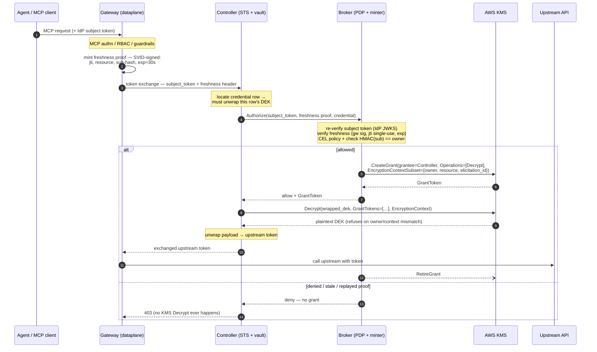

In [part 1](/credential-brokering-patterns-for-ai-agent-egress/) I made the case that the only credential brokering model from [the CB4A paper](https://www.ietf.org/archive/id/draft-hartman-credential-broker-4-agents-00.html) that really works for AI agents today is the one where the agent never holds a credential at all. The agent uses its identity/OBO, calls through the proxy, the proxy injects the real token just in time, and the agent's memory never contains any credential. The agent can't be tricked to exfiltrate (or willingly hand over) any credentials.

Although the agent doesn't see the real tokens, we didn't really _get rid of them_. We just moved them. The proxy's token store now holds every user's GitHub token, every Slack token, every upstream API key in the environment. The CB4A draft is blunt about this: the broker ["is the highest-value target in the architecture."](https://www.ietf.org/archive/id/draft-hartman-credential-broker-4-agents-00.html#name-security-considerations) If the broker/controller/etc is compromised its blast radius is all of the credentials.

The CB4A paper refers to the [LiteLLM incident](https://docs.litellm.ai/blog/security-update-march-2026) here. That was a **supply-chain RCE** where the attacker compromised a component that holds (or can get to) the keys (actually it was much worse; but focusing on the supply-chain-controller-compromise aspect for this blog). "We encrypt at rest" is not an answer to that. The compromised process *is* the thing holding the decryption capability.

So this post builds on Part 1 by looking at the real "high value target" of the credential brokering credential process and answer one narrow question:

> **When the process holding the token store is fully compromised, how much of the store can the attacker read?**

Let's look at three different approaches to securing this broker, and the answer to the above question for each. Forewarning: we will look at an implementation with AWS KMS, but we will also do OpenBAO/Vault in Part 3!

## Who holds what

In Solo.io Enterprise for agentgateway, two components are core to an agentic call to an external resource. The **gateway** (the Rust dataplane) terminates the agent's MCP connection, enforces policy, and calls token exchange to get an upstream credential. The **controller** runs the Secure Token Service (STS) which does RFC 8693 token exchange and owns the token vault. The controller/STS is responsible for encrypting the database rows holding user credentials.

The controller (aka STS, but I'll refer to it as controller) is the blast radius center. It holds the ciphertext, it does the decrypt, and it hands the plaintext credential back to the gateway. It's the component that *has* to touch plaintext, which is exactly what makes it interesting. One assumption held constant throughout: the gateway is inside the confidentiality boundary for the specific token a live request is servicing. It has to be. It's the thing putting that token on the wire to GitHub for example. What we're protecting is **the rest of the store**: everyone else's credentials, and this user's other credentials, at the moment of compromise.

## Envelope encryption, quickly

Every stored credential gets two nested AES-256-GCM layers.

| Layer | Encrypts | Key | Computed by |
|---|---|---|---|
| **Inner** | the token JSON (access, refresh, id token) | a per-write **DEK** | the controller, in-process — in every mode |
| **Outer** | the 32-byte DEK | the **KEK** | whoever holds the KEK |

A **DEK** (data encryption key) is generated fresh on every write, so a token refresh rotates it. The DEK encrypts the payload locally, then the DEK itself gets **wrapped** (encrypted) under a **KEK** (key encryption key). Reading a credential means unwrapping its DEK first, then decrypting the payload with it. Why bother with two layers? Because the KEK only ever encrypts and decrypts 32-byte DEKs, never application data — so it can live somewhere the application can't reach.

Both layers bind their ciphertext to context using **AAD**, additional authenticated data. AAD isn't encrypted and isn't secret. It gets mixed into the GCM authentication tag. Present different AAD at decrypt time and the tag fails, so ciphertext can't be moved between rows or between users.

The AAD on the outer layer is the one that matters later. Alongside the row's identity and key metadata, it carries:

```
owner    = HMAC(user_id)          # <-- this one does the real work later
resource = e.g. https://api.github.com
```

That binding is the same in all three modes below. What changes is **who authenticates it**: either a local AES-GCM tag the controller computes itself, or a KMS `EncryptionContext` that KMS checks on every wrap and unwrap and records in CloudTrail. Same binding, different referee, and the referee turns out to be the whole story.

One consequence worth stating up front: `owner` and `resource` are also kept as plain columns, because the binding has to be reproducible at decrypt time. That's what lets an authorization decision happen *before* any decrypt. You can read who owns a credential without unwrapping it.

To start off, we have to answer **who holds the KEK, and what it takes to unwrap a DEK?**

## Mode 1 — KEK in a Kubernetes Secret

This is an obvious default or baseline. A 32-byte KEK lives in a Kubernetes Secret, read once at pod startup. Wrap and unwrap are local AES-GCM calls inside the controller.

```yaml
tokenExchange:
  enabled: true
  storage:
    envelope:
      provider: k8s-secret      # default
```

If we evaluate this against our main question of this blog, what is the blast radius if the controller is compromised:

- **DB dump theft?** On its own, not a real problem. A stolen `encrypted_tokens` table is ciphertext. Nobody can do anything with it. 
- **Controller compromise?** If this happens, you have a catastrophic failure. The KEK lives in the same trust domain as the thing you're worried about. Anyone who can read that Secret (the controller's ServiceAccount, any cluster-admin, an etcd backup, a node with the projected token) gets the master key and decrypts **the entire store, offline, forever**. The attacker doesn't even have to stay around/online. Steal the KEK once and every current *and future* row is readable off-box, at leisure.
- **Residual:** everything. No audit trail, because these are in-process AES calls and they're invisible. No revocation, because you can't un-leak a key. 

So the answer to the main question: "All of the store, all credentials, all users". Not good. You should not do this for anything other a very simple demo environment. This should not be used in production under any circumstances. 

## Mode 2 — KEK in AWS KMS

We use AWS KMS in the scenarios that follow but other providers could be substituted. In part 3, I'll show how to do with Hashicorp Vault/OpenBAO. But for now, we'll look at an AWS-specific example where the KEK is a KMS customer key that **never leaves KMS**. The controller wraps and unwraps by calling `kms:Encrypt` and `kms:Decrypt`, passing the per-row `EncryptionContext`, which KMS authenticates on both calls and writes into CloudTrail.

```yaml
tokenExchange:
  enabled: true
  storage:
    envelope:
      provider: aws-kms
      awskms:
        keyId: alias/agw-token-exchange
        region: us-west-2
```

The controller's IAM identity gets `kms:Encrypt`, `kms:Decrypt`, `kms:DescribeKey`. Use IRSA, pod identities, workload federation, etc in production.

What this buys over Mode 1 is substantial. The master key is no longer in your cluster, in etcd, in a backup, or in controller memory. And every unwrap becomes an IAM-gated, per-call, auditable, revocable event instead of an invisible in-process operation. CloudTrail shows you the full encryption context on every decrypt. 

But I want to be really clear about something, because although this is a step in the right direction:

> **KMS does not stop a compromised controller from decrypting your store. It stops it from decrypting silently, in bulk, and offline.**

The controller still holds **standing `kms:Decrypt`**. A live compromised process can sit there and call KMS in a loop until it's walked the whole table. KMS makes that burst visible and lets you pull the key, but it does not *prevent* it. Symmetric decrypt quotas are high and rate limiting can be a weak throttle. Exfiltration can outrun your incident response.

What you've really done is convert a smash-and-grab into a live, throttleable, observable operation. That's a genuinely different posture, and for a lot of deployments it's the honest place to stop: master key custody, plus audit, plus revocation, with loud CloudTrail alerting on decrypt-rate anomalies and a few honeytoken rows planted in the store. If "detectable and revocable" is good enough for your threat model, you're good to stop here.

- **DB theft?** Survives.
- **Controller compromise?** Partially. Whole store while the attacker is live, audited and revocable, but not prevented.
- **Residual:** an in-process attacker driving the live unwrap path under your rate limits and alerting.

## Mode 3 — Broker-gated KMS grants

Now let's look at taking away the standing decrypt from the controller, completely.

The controller keeps the ciphertext and its role as an KMS **grantee**, and loses `kms:Decrypt` entirely. Every decrypt now needs a short-lived, credential-scoped **grant**, minted on demand by a separate **broker**. The broker holds `kms:CreateGrant` and has no database, no ciphertext, no DEKs, and no ability to decrypt anything at all.

Decryption now requires **two independent trust domains**. The broker has to authorize, *and* the controller has to be the grantee holding the ciphertext. Neither one alone can read a credential. Although this is not EXACTLY the implementation [proposed by the CB4A paper](https://www.ietf.org/archive/id/draft-hartman-credential-broker-4-agents-00.html), it does align with its principals: separate out into different trust domains the "policy" or grant from the thing that can issue/mint. 

For example, in Solo.io Enterprise for Agentgateway, the controller's config is Mode 2 plus a pointer at the broker and an `enforce` mode:

```yaml
# controller — same as Mode 2, plus:
tokenExchange:
  authorization:
    mode: enforce             # off | audit | enforce
    broker:
      url: http://...grant-broker...:8081
```

The broker runs as a separate Deployment with its own ServiceAccount and its own IAM identity. It's configured with the IdP it re-verifies subject tokens against, a policy expression for allow/deny, the shared key it uses to derive `owner`, an audit sink, and the AWS parameters for minting grants. What it is emphatically *not* configured with is a database, a KEK, or any path to ciphertext.

Here's the flow:




### "Why not just let KMS authorize each call?"

This is the obvious objection and it deserves a straight answer, because the answer is what makes the broker structurally *necessary* instead of just recommended.

The cheaper idea goes like this: keep the controller's standing access, and let the managed service authorize per key on every call. KMS has `kms:EncryptionContext:*` policy conditions. Vault has per-secret ACLs. Why not just use those?

Because of **which identity the managed service authenticates**. When the controller calls KMS, KMS authenticates *the controller's IAM role*. It never sees the end user. And a key policy is **static**: it can pin the encryption context to a *constant*, but it can't express "`owner` must equal whoever is authenticated on *this* request," because nothing in that path knows who that is. A controller with `kms:Decrypt` decrypts every row. Vault is the same story. If the controller can read the mount, it reads every secret in it. Vault's templated per-entity policies only help when *the user* is the authenticating identity, and here the controller acts on behalf of users who never authenticate to Vault at all.

The only KMS mechanism for dynamic, per-request, per-user scoping is a **grant**: short-lived, `EncryptionContextSubset`-scoped, minted **by a separate principal**. And that principal has to re-verify the user before it mints, or the scoping means nothing.

That principal *is* the broker. So the broker isn't an extra component bolted onto per-key callback. It's what per-user scoping turns into once you follow the requirement all the way down.

Mode 3 is a tradeoff, of course. It's more latency, more code, more operational surface, and a new trusted component to lock down (the broker). Its return is a better answer to the original question: *prevented* rather than merely detected single-component mass decrypt, per-user cryptographic scoping, liveness binding, etc.

## The Main Point

Line the three modes up against the one question we started with, and what you're really watching is the "yes" to decrypt moving further away from the component holding the ciphertext. Mode 1: the controller says yes to itself, silently, forever. Mode 2: the controller still says yes, but now it has to say it out loud to KMS, on the record, every single time. Mode 3: the controller can't say yes at all. It has to bring a broker along, and the broker has to re-verify the human behind the request before it'll mint anything. By the end, reading a credential requires two things that are never true at once for an attacker who only owns the controller: the ciphertext, and a grant nobody but the broker can issue.

But AWS KMS is just one way to answer "who holds the KEK, and who's allowed to unwrap it." It's not the only way, and a lot of enterprises aren't on AWS, or already run a Vault/OpenBAO cluster doing this exact job for everything else in the environment. Part 3 of this blog series stays focused on Mode 3 -- the broker-gated grant model -- and rebuilds it on Vault/OpenBAO instead of KMS. In Mode 3 the KEK lives in the transit engine, and the grant becomes a Vault-issued, single-use, time-boxed token instead of an IAM grant. Stay tuned!!

